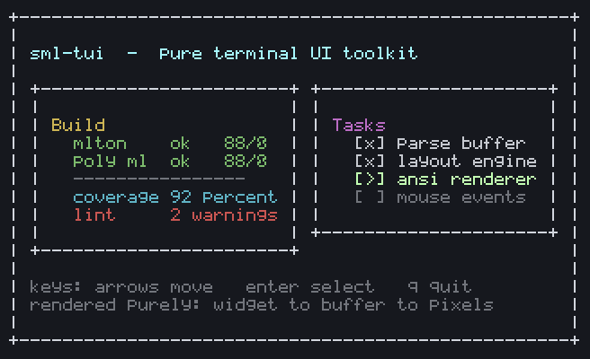

# sml-tui

A pure, Elm-architecture **terminal UI toolkit** for Standard ML. Build
interactive text interfaces from a declarative widget tree, render them to an
immutable screen buffer, and serialize that buffer to ANSI escape codes — all
with zero FFI and full MLton + Poly/ML support.



*Generated by [`examples/dashboard.sml`](examples/dashboard.sml) (`make
screenshot`): a styled widget tree laid out into a `Tui.buffer` (the same pure
pipeline behind `toAnsi`), with every cell rasterized - background plus glyph
in its fg color - to a PNG. The interactive [`counter`](examples/counter.sml)
(`make example`) runs the same widgets in a real terminal.*

The entire pipeline (`widget → buffer → ANSI string`) is pure and deterministic,
so every frame your app produces can be snapshot-tested without ever touching a
real terminal. The only impure code is a single `Tui.run` event loop.

## Why

Most TUI libraries are thin wrappers over ncurses with a stateful, imperative
core. `sml-tui` instead borrows the [Elm Architecture](https://guide.elm-lang.org/architecture/):
your application is three pure functions — `init`, `update`, and `view` — plus a
mapping from keystrokes to messages. The framework owns the loop; you own the
logic, and your logic stays testable.

```
init : model
update : msg -> model -> model
view : model -> widget
```

## Installation

```
smlpkg add github.com/sjqtentacles/sml-tui
smlpkg sync
```

## Quick start: an Elm-style counter

```sml
type model = { count : int, running : bool }
datatype msg = Inc | Dec | Quit

val update =
  fn Inc  => (fn m => { count = #count m + 1, running = #running m })
   | Dec  => (fn m => { count = #count m - 1, running = #running m })
   | Quit => (fn m => { count = #count m, running = false })

fun view (m : model) =
  let open Tui in
    Border (Pad (1, VBox
      [ Text (bold (fg Cyan), "Count: " ^ Int.toString (#count m))
      , Lines (fg (Bright Black), ["[+] up   [-] down   [q] quit"]) ]))
  end

val app : (model, msg) Tui.app =
  { init   = { count = 0, running = true }
  , update = update
  , view   = view
  , onKey  = (fn Tui.Char #"+" => SOME Inc
               | Tui.Char #"-" => SOME Dec
               | Tui.Char #"q" => SOME Quit
               | _             => NONE)
  , quit   = (fn m => not (#running m)) }

val _ = Tui.run app
```

Renders as:

```
+------------------------+
|                        |
| sml-tui counter        |
|                        |
| Count: 3               |
|                        |
| [+ / =/ up]  increment |
| [- / down]   decrement |
| [r]          reset     |
| [q / esc]    quit      |
|                        |
+------------------------+
```

Run the bundled example:

```
make example && ./bin/counter
```

## Concepts

### Colors and styles

```sml
Tui.defaultStyle                       (* terminal defaults *)
Tui.fg Tui.Red                         (* red foreground *)
Tui.withBg Tui.Blue (Tui.fg Tui.White) (* white on blue *)
Tui.bold (Tui.fg (Tui.Bright Tui.Green))
Tui.fg (Tui.Color256 200)              (* xterm 256-color palette *)
```

Styles compile to ANSI SGR parameters via `Tui.styleSgr`, e.g. bold red on
white is `"1;31;47"`.

### The screen buffer

An immutable grid of `{ ch, style }` cells with a top-left origin. Every drawing
primitive returns a **new** buffer; nothing is mutated. Out-of-bounds draws are
silently clipped.

```sml
val b = Tui.make (20, 5)                       (* 20x5, filled with spaces *)
val b = Tui.drawText b (1,1) (Tui.fg Tui.Red) "hello"
val b = Tui.drawBox  b {x=0,y=0,w=20,h=5} Tui.defaultStyle
val s = Tui.toText b                           (* plain text, rows joined by \n *)
val a = Tui.toAnsi b                           (* full styled ANSI frame *)
```

### Widgets

A small declarative layout language. `measure` gives a widget's natural size;
`render` paints it into a buffer; `draw` allocates a perfectly-sized buffer and
renders into it.

| Widget                  | Meaning                                  |
|-------------------------|------------------------------------------|
| `Text (style, s)`       | a single styled line                     |
| `Lines (style, ss)`     | several stacked lines                    |
| `VBox ws`               | stack children top to bottom             |
| `HBox ws`               | place children left to right             |
| `Border w`              | single-line box around a child           |
| `Pad (n, w)`            | `n` spaces of padding on every side      |
| `Fixed (w, h, child)`   | clamp a child into a fixed `w × h` region|

### Input

`parseKey` turns the leading bytes of raw terminal input into a `key`, handling
ANSI escape sequences (arrows, Home/End) and returning how many bytes it
consumed. It is pure and total:

```sml
Tui.parseKey "\027[A"  = (Tui.Up, 3)
Tui.parseKey "q"       = (Tui.Char #"q", 1)
```

### The runtime

```sml
type ('model, 'msg) app =
  { init   : 'model
  , update : 'msg -> 'model -> 'model
  , view   : 'model -> widget
  , onKey  : key -> 'msg option
  , quit   : 'model -> bool }
```

- `Tui.step app event model` — purely advance the model by one event (testable).
- `Tui.frame app model` — render the current model to its ANSI frame string.
- `Tui.run app` — the **only** impure function: puts the terminal in raw mode,
  draws frames, pumps keystrokes, and restores the terminal on exit.

Because `step` and `frame` are pure, you can drive and assert on an entire
session in a unit test with no terminal involved.

## Testing

```
make test       # MLton
make test-poly  # Poly/ML
make all-tests  # both
```

72 tests cover colors/SGR, buffer drawing and clipping, layout/measure, ANSI
serialization, key parsing, and the Elm runtime.

## Design notes

- **Pure core, thin impure edge.** Everything except `Tui.run` is referentially
  transparent. The impure loop is a few dozen lines isolated at the bottom of
  `tui.sml`.
- **One byte per cell.** The buffer stores `char` cells, so box-drawing uses
  ASCII (`+ - |`) to keep one glyph per column and remain snapshot-stable.
- **No dependencies, no FFI.** Pure Standard ML on the Basis Library only.

## License

MIT
